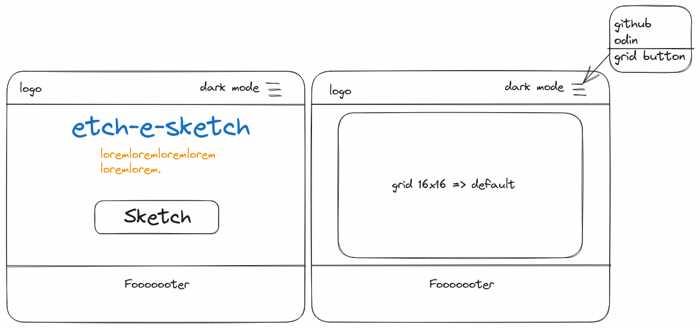
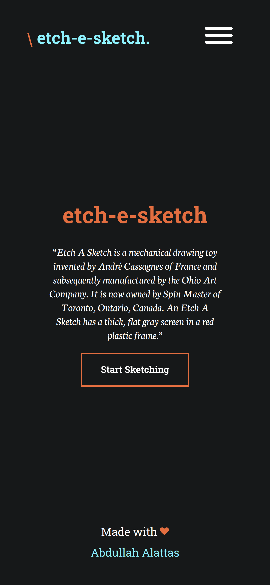
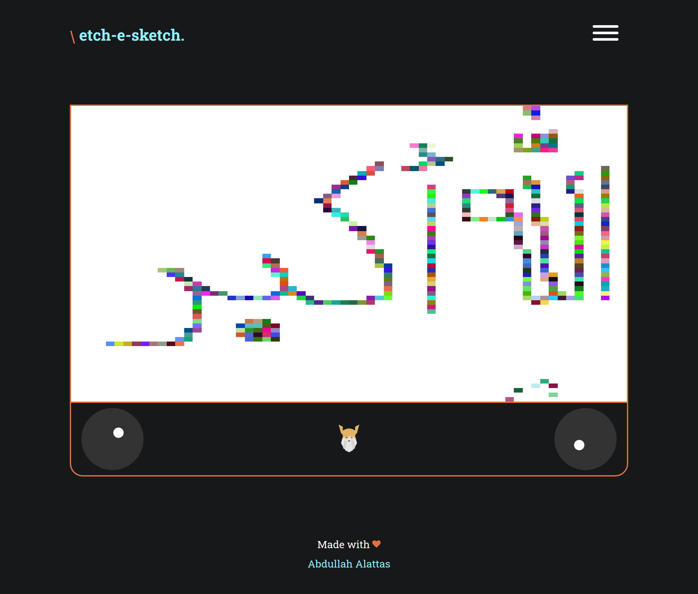

# etch-a-sketch

Browser version of something between a sketchpad and an Etch-A-Sketch.

## Demo

You can try it online [here](https://i4pg.github.io/etch-a-sketch/).

## Features

<!-- * Nice shuffling for rock paper scissors choices -->
<!-- * Light/Dark mode -->
<!-- * The winner is displayed at the end of the game. -->
<!-- * The game keeps running and calculating points. -->
<!-- * Responsive mobile-first design -->

## Showcase

### Wireframe

> NOTE: For now I decided to not go with dark/light mode feature

### ScreenShots

## Getting Started

### Usage

You can try it online [here](https://i4pg.github.io/etch-a-sketch/).

### Installation

To run this program locally, you can clone the repository to your local machine using the following command:

`git clone https://github.com/i4pg/etch-a-sketch.git`

Then open the `index.html` file in your web browser to start playing the game.

<!-- ### To-do -->

<!-- - [x] Wireframe -->
<!-- - [x] UI -->
<!--  - [x] dropdown -->
<!--  - [x] grid options  -->
<!--  - [x] sketch button -->
<!--  - [x] page title -->
<!-- - [x] Create 16x16 grid of square `div`s -->
<!--     - [x] Create it dynamically using  JS -->
<!--     - [x] put it all in a `.container` -->
<!--     - [x] make it appear as grid vs. One on each line -->
<!--     - [x] No `margin`, `padding` -->
<!-- - [x] Setup `:hover` effect -->
<!--     - [x] CSS class or JS ? -->
<!-- - [x] Make button for choosing grid size -->
<!--     - [x] Replace the old grid -->
<!--     - [x] All in one container -fixed space- -->
<!--     - [x] Max = 100 -->
<!--     - [x] JS fun when button clicked -->
<!--     - [x] `prompt` -->
<!-- - [x] debugging -->
<!--     - [x] 64x64 works? -->
<!-- - [x] Each pass through change it to a completely random RGB value. Then each pass just add another 10% of black to it so that only after 10 passes is the square completely black. -->

## Contributing

Contributions to this project are welcome. To contribute, follow these steps:

1.  Fork this repository.
    
2.  Create a new branch with your changes:
    
    `git checkout -b my-new-branch`
3.  Make your changes and commit them:
    
    `git commit -am 'Add some feature'`
4.  Push your changes to your forked repository:
    
    `git push origin my-new-branch`
5.  Create a pull request on this repository.
    

## License

This project is licensed under the MIT License. See the [LICENSE](LICENSE) file for details.
